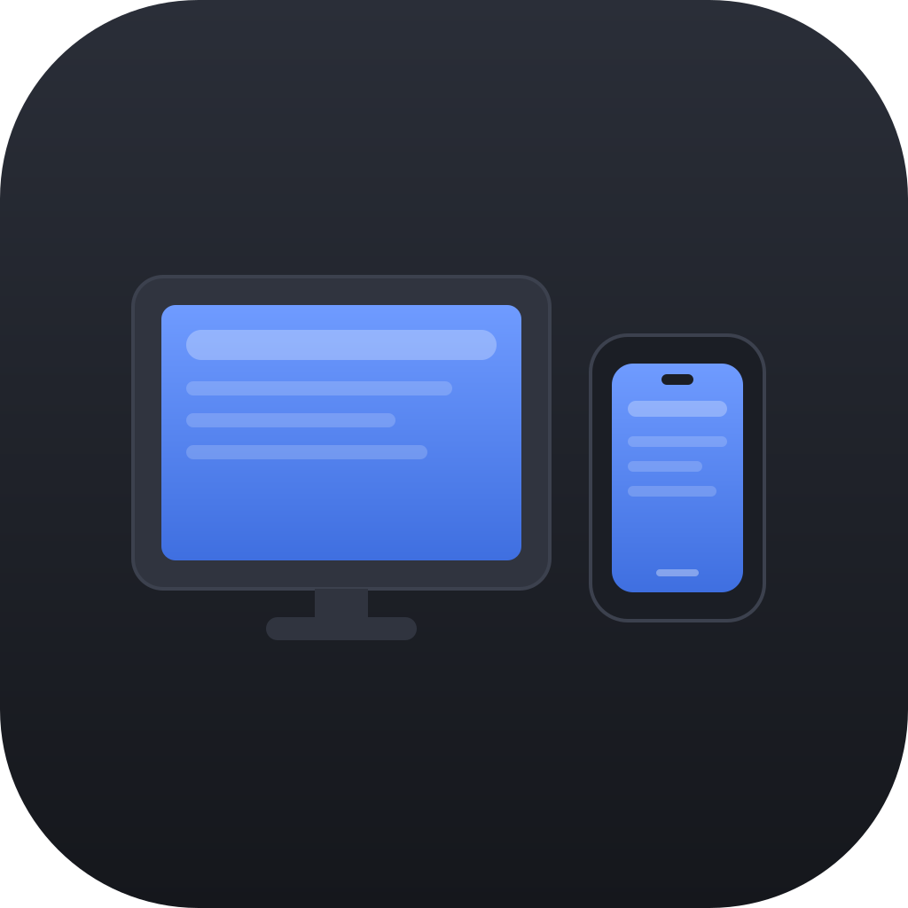
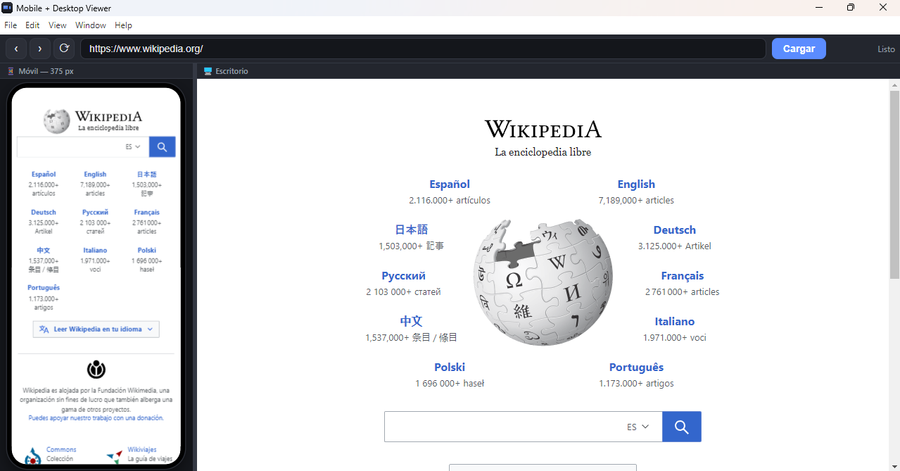
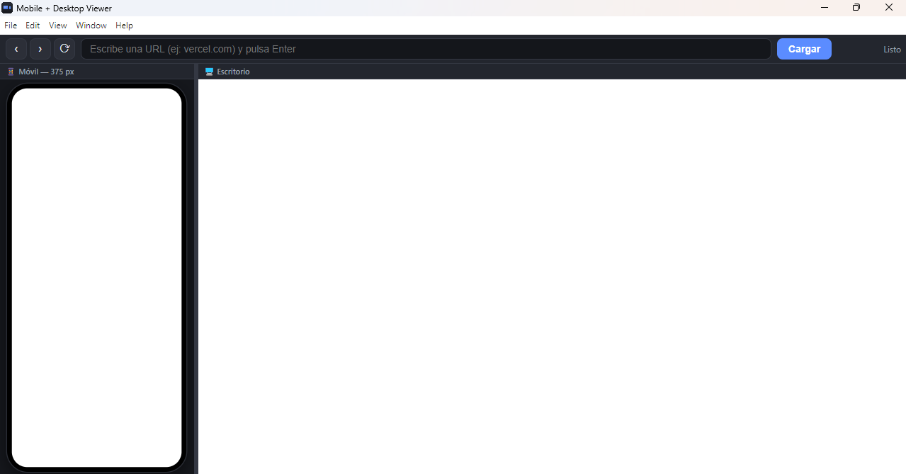

# Mobile + Desktop Viewer

App de escritorio (Electron) para ver cualquier URL simultáneamente en una
**vista móvil** (con marco de teléfono, viewport de 375 px) y una **vista de
escritorio**, lado a lado. Pensada para grabar el contenido con un grabador de
vídeo externo.



## Capturas

Una página cargada en ambas vistas a la vez (móvil 375 px + escritorio), con el
scroll sincronizado:



Estado inicial, listo para escribir una URL:



## Descargar (usuarios)

Descarga el instalador de Windows desde la
**[página de Releases](https://github.com/Javi2597/appmobilydesktop/releases/latest)**:

1. Baja el archivo `Mobile.Desktop.Viewer.Setup.x.y.z.exe`.
2. Ejecútalo. Podrás elegir carpeta de instalación; crea accesos directos en el
   escritorio y el menú inicio.

> ⚠️ Como el instalador no está firmado con un certificado de pago, Windows
> mostrará un aviso de SmartScreen. Pulsa **Más información → Ejecutar de todas
> formas**.

## Por qué Electron y no una web normal

Usa la etiqueta `<webview>` de Electron, que carga las páginas como un navegador
real. Una web con `<iframe>` fallaría con la mayoría de sitios porque bloquean
ser incrustados (cabeceras `X-Frame-Options` / CSP `frame-ancestors`). Por la
misma razón **no funciona como sitio estático** (GitHub Pages / Vercel): es una
app de escritorio.

## Uso

- Escribe una URL en la barra superior y pulsa **Enter** (o el botón *Cargar*).
  Si no pones `http(s)://`, se añade `https://` automáticamente. Solo se aceptan
  URLs `http`/`https`.
- Ambas vistas (móvil y escritorio) navegan juntas.
- El **scroll está sincronizado** entre ambas por porcentaje, para que muestren
  la misma sección aunque tengan alturas distintas.
- Botones ‹ › ⟳ para atrás / adelante / recargar en las dos vistas.
- Arrastra el **divisor** central para cambiar el ancho de la columna móvil
  (el marco del teléfono se reescala solo para encajar).

## Desarrollo

Requiere [pnpm](https://pnpm.io) y Node.js.

```bash
pnpm install
pnpm start        # arranca la app en modo desarrollo
```

## Seguridad

La app carga contenido web no confiable, así que está endurecida (hardening de
Electron):

- `contextIsolation: true`, `nodeIntegration: false` y `sandbox: true`.
- Cada `<webview>` se fuerza a configuración segura desde el proceso principal
  (`will-attach-webview`), sin depender de los atributos del HTML.
- La ventana de la UI no puede navegar fuera de `index.html`.
- Solo se permiten esquemas `http`/`https` (se bloquean `file://`,
  `javascript:`, `data:`…).
- Las ventanas emergentes de las webs se abren en el navegador del sistema.

## Estructura

| Archivo                     | Función                                                   |
|-----------------------------|-----------------------------------------------------------|
| `main.js`                   | Proceso principal de Electron: ventana + hardening        |
| `index.html`                | Interfaz: barra de URL + split móvil/escritorio           |
| `styles.css`                | Estilos, marco del teléfono, layout                       |
| `renderer.js`               | Lógica: cargar URL, navegación, scroll sync, escalado     |
| `build/icon.svg`            | Fuente vectorial del icono                                 |
| `scripts/generate-icon.mjs` | Genera `icon.ico` / `icon.png` desde el SVG               |

## Notas

- El `.npmrc` incluye `verify-deps-before-run-scripts=false` y las aprobaciones
  de build scripts viven en `pnpm-workspace.yaml` (`allowBuilds`), por el
  comportamiento de pnpm con Electron.
- Para grabar solo la ventana, usa la grabación de ventana de tu grabador
  (OBS, Xbox Game Bar `Win+G`, etc.).

## Licencia

MIT
